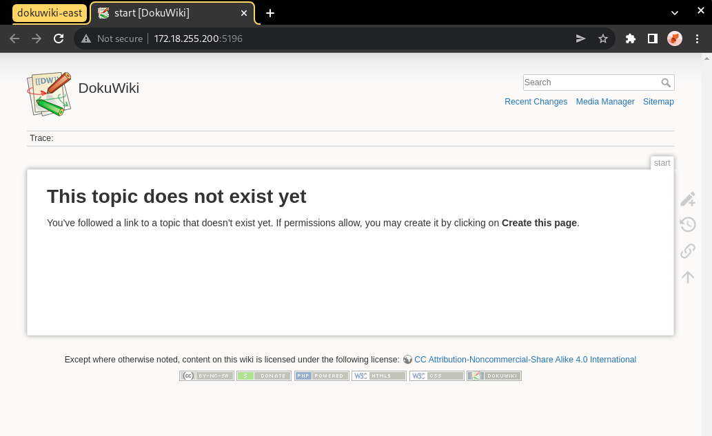
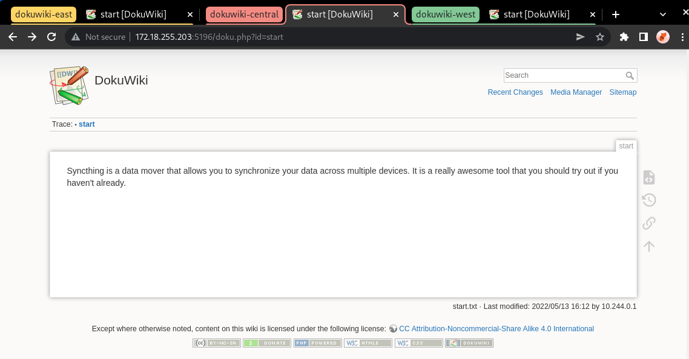
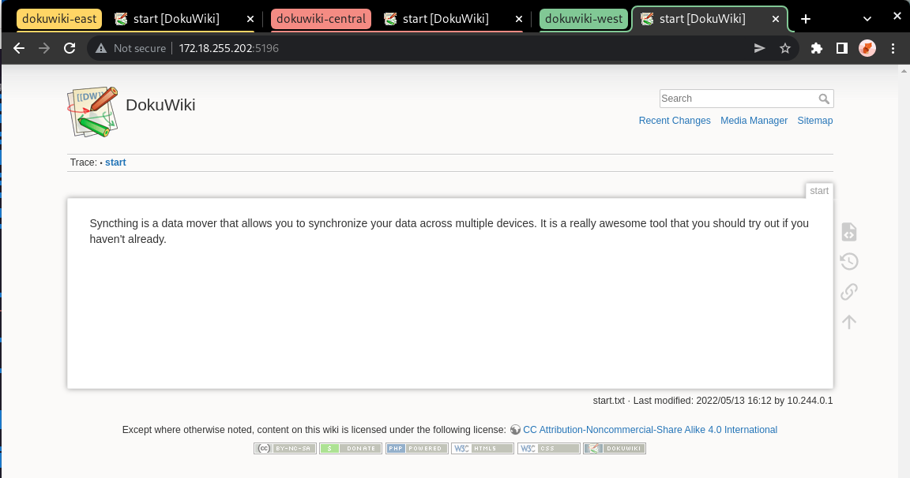
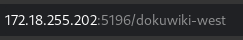
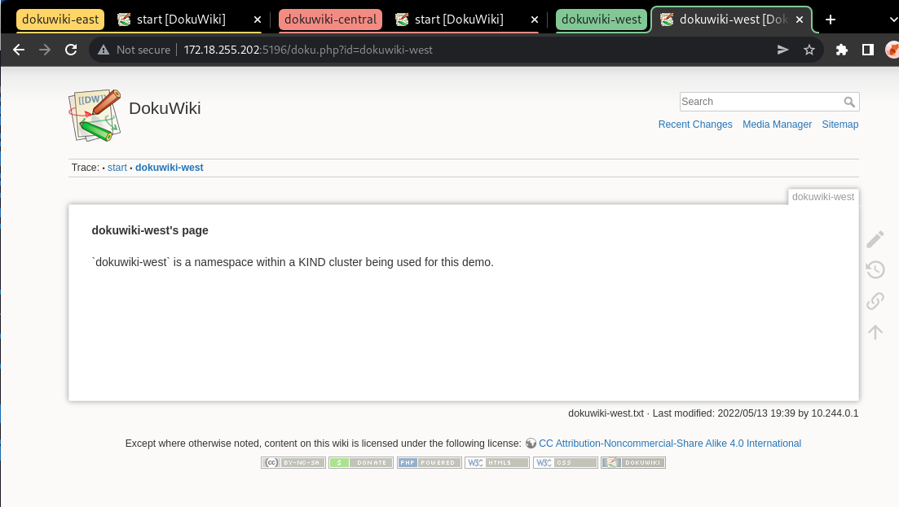
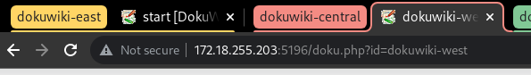
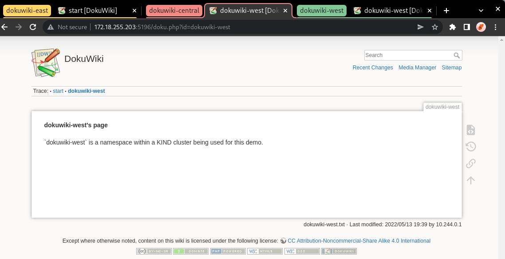

==========================
Syncthing Dokuwiki Example
==========================

.. note::
  This tutorial requires the usage of LoadBalancer to expose applications
  from within the cluster. If you are running a KIND cluster, please
  follow this guide to install metallb if you haven't already: https://kind.sigs.k8s.io/docs/user/loadbalancer/

In this example, we will demonstrate how Syncthing can be used to maintain a synchronized
volume across several Dokuwiki application instances.

First, create a namespace for the Dokuwiki application and launch the required resources:

.. code-block:: bash

   kubectl create ns dokuwiki-east
   kubectl apply -f examples/dokuwiki/ -n dokuwiki-east

Ensure that we can access the dokuwiki application by obtaining the external IP address:

.. code-block:: console

  $ kubectl get service -n dokuwiki-east dokuwiki-service
  NAME               TYPE           CLUSTER-IP      EXTERNAL-IP      PORT(S)          AGE
  dokuwiki-service   LoadBalancer   10.96.231.229   172.18.255.200   5196:30113/TCP   16m

Open your browser and navigate to the value in your ``EXTERNAL-IP`` field, in our case it is ``172.18.255.200:5196``.
This should take you to the front-end for the Dokuwiki application. You'll be able to create new wiki pages here, as well as edit existing ones.

Once opened, you should see a page like this:

Now let's populate our DokuWiki with its first page, and what better subject to
talk about then the Syncthing data mover?

Create a new page on the DokuWiki website with the following contents:

.. code-block::

  Syncthing is a data mover that allows you to synchronize your data across multiple devices.
  It's an awesome tool that you should try out if you haven't already.

Now let's create a Syncthing-based ReplicationSource to synchronize the data within our DokuWiki PVC:

.. code-block:: console

  $ kubectl apply -f examples/syncthing/replicationsource_empty.yaml -n dokuwiki-east
  replicationsource.volsync.backube/sync-dokuwiki created

Let's retrieve our ReplicationSource's Syncthing information once it becomes available:

.. code-block:: console

  $ kubectl get replicationsource -n dokuwiki-east sync-dokuwiki \
    -o jsonpath='{.status.syncthing}' -w
  {"ID":"TMBYRB4-EIINYAW-ZFBX4LV-7FE37NT-BLQPSKB-P2BFIPW-QW6ST3C-PSU7UQD","address":"tcp://10.96.217.239:22000"}

Once the above data becomes available, let's save the Syncthing ID and address as an environment variable in our shell
so that we can reuse it later.

.. code-block:: console

  export SYNCTHING_EAST_ID=$(kubectl get replicationsource -n dokuwiki-east sync-dokuwiki -o jsonpath='{.status.syncthing.ID}')
  export SYNCTHING_EAST_ADDRESS=$(kubectl get replicationsource -n dokuwiki-east sync-dokuwiki -o jsonpath='{.status.syncthing.address}')

Now that ``dokuwiki-east`` is all configured, let's create two other namespaces with their own DokuWiki applications: ``dokuwiki-west`` and ``dokuwiki-central``.

.. code-block:: console

  kubectl create ns dokuwiki-west
  kubectl create ns dokuwiki-central

We'll launch a DokuWiki application in each namespace:

.. code-block:: console

  kubectl apply -f examples/dokuwiki/ -n dokuwiki-west
  kubectl apply -f examples/dokuwiki/ -n dokuwiki-central

These can now be accessed through their own respective external IP addresses:

.. code-block:: console
  :caption: Obtaining the External IP for ``dokuwiki-west``

  $ kubectl get service -n dokuwiki-west dokuwiki-service
  NAME               TYPE           CLUSTER-IP      EXTERNAL-IP      PORT(S)          AGE
  dokuwiki-service   LoadBalancer   10.96.142.135   172.18.255.202   5196:32364/TCP   114s

.. code-block:: console
  :caption: Obtaining the External IP for ``dokuwiki-central``

  $ kubectl get service -n dokuwiki-central dokuwiki-service
  NAME               TYPE           CLUSTER-IP      EXTERNAL-IP      PORT(S)          AGE
  dokuwiki-service   LoadBalancer   10.96.254.251   172.18.255.203   5196:31687/TCP   2m32s

Go ahead and open both of these up in their own respective tabs.
You should see empty pages for both ``dokuwiki-west`` and ``dokuwiki-central``.

Let's change this by creating Syncthing-based ReplicationSources in each of these namespaces,
and configuring them to use ``dokuwiki-east`` as their introducer node.

Using the information that we obtained from the ReplicationSource in ``dokuwiki-east`` earlier,
create a ReplicationSource with the following contents and apply it in each namespace:

.. code-block:: bash
  :caption: Syncthing-based ReplicationSource using ``dokuwiki-east`` as an introducer

  for ns in dokuwiki-west dokuwiki-central; do
  cat <<EOF | kubectl apply -n "${ns}" -f -
  kind: ReplicationSource
  apiVersion: volsync.backube/v1alpha1
  metadata:
    name: sync-dokuwiki
  spec:
    sourcePVC: dokuwiki-pvc
    syncthing:
      serviceType: ClusterIP
      peers:
      - ID: ${SYNCTHING_EAST_ID}
        address: ${SYNCTHING_EAST_ADDRESS}
        introducer: true
  EOF
  done

This will create Syncthing-based ReplicationSources in both namespaces configured to sync the PVC which stores DokuWiki's data.
These ReplicationSources will be configured to use ``dokuwiki-east`` as their introducer node.

To complete the process, we must add ``dokuwiki-west`` and ``dokuwiki-central`` as peers into the ``dokuwiki-east`` ReplicationSource.
Since both ``dokuwiki-west`` and ``dokuwiki-central`` are now configured to use ``dokuwiki-east`` as their introducer node,
we will not have to do any extra work to get these two connected with each other.

First, let's save the Syncthing information of ``dokuwiki-west`` and ``dokuwiki-central``:
Wait until the Syncthing information is available in ``dokuwiki-west``, then save it into the respective variables:

.. code-block:: console

  $ kubectl get replicationsource -n dokuwiki-west sync-dokuwiki -o jsonpath='{.status.syncthing}' -w
  $ export SYNCTHING_WEST_ID=$(kubectl get replicationsource -n dokuwiki-west sync-dokuwiki -o jsonpath='{.status.syncthing.ID}')
  $ export SYNCTHING_WEST_ADDRESS=$(kubectl get replicationsource -n dokuwiki-west sync-dokuwiki -o jsonpath='{.status.syncthing.address}')

Now repeat the same process for ``dokuwiki-central``:

.. code-block:: console

  $ kubectl get replicationsource -n dokuwiki-central sync-dokuwiki -o jsonpath='{.status.syncthing}' -w
  $ export SYNCTHING_CENTRAL_ID=$(kubectl get replicationsource -n dokuwiki-central sync-dokuwiki -o jsonpath='{.status.syncthing.ID}')
  $ export SYNCTHING_CENTRAL_ADDRESS=$(kubectl get replicationsource -n dokuwiki-central sync-dokuwiki -o jsonpath='{.status.syncthing.address}')

Now that we have the Syncthing information of both namespaces, let's add them as peers to the ``dokuwiki-east`` ReplicationSource:

.. code-block:: bash

  cat <<EOF | kubectl apply -n dokuwiki-east -f -
  kind: ReplicationSource
  apiVersion: volsync.backube/v1alpha1
  metadata:
    name: sync-dokuwiki
  spec:
    sourcePVC: dokuwiki-pvc
    syncthing:
      serviceType: ClusterIP
      peers:
      - ID: $SYNCTHING_CENTRAL_ID
        address: $SYNCTHING_CENTRAL_ADDRESS
        introducer: false
      - ID: $SYNCTHING_WEST_ID
        address: $SYNCTHING_WEST_ADDRESS
        introducer: false
  EOF

Once this configures, we'll see that ``dokuwiki-east`` is now connected to both ``dokuwiki-west`` and ``dokuwiki-central``:

.. code-block:: shell
  :caption: Peers connected to ``dokuwiki-east``

  $ kubectl get replicationsource sync-dokuwiki -n dokuwiki-east -o jsonpath='{.status.syncthing.peers}' | jq
  [
    {
      "ID": "LMZRG5Y-TPMJ3EW-HJ4C7EQ-IK2JPCY-YHXDWLW-T7G3XIX-VCKB4F6-EQ5X2QI",
      "address": "tcp://10.96.246.238:22000",
      "connected": true,
      "deviceName": "volsync-sync-dokuwiki-f59cd4b9c-r6f4c"
    },
    {
      "ID": "MIOOI4E-5PWWT4F-QRRRSWG-PZAXB4I-E6STCCG-25TARPP-ONTUNLN-QFVQTAE",
      "address": "tcp://10.244.0.27:22000",
      "connected": true,
      "deviceName": "volsync-sync-dokuwiki-f59cd4b9c-dhpjs"
    }
  ]

We can also see that ``dokuwiki-central`` was introduced and connected to ``dokuwiki-west`` by ``dokuwiki-east``:

.. code-block:: shell
  :caption: Peers connected to ``dokuwiki-central``

  $ kubectl get replicationsource sync-dokuwiki -n dokuwiki-central -o jsonpath='{.status.syncthing.peers}' | jq
  [
    {
      "ID": "LMZRG5Y-TPMJ3EW-HJ4C7EQ-IK2JPCY-YHXDWLW-T7G3XIX-VCKB4F6-EQ5X2QI",
      "address": "tcp://10.96.246.238:22000",
      "connected": true,
      "deviceName": "volsync-sync-dokuwiki-f59cd4b9c-r6f4c",
      "introducedBy": "TMBYRB4-EIINYAW-ZFBX4LV-7FE37NT-BLQPSKB-P2BFIPW-QW6ST3C-PSU7UQD"
    },
    {
      "ID": "TMBYRB4-EIINYAW-ZFBX4LV-7FE37NT-BLQPSKB-P2BFIPW-QW6ST3C-PSU7UQD",
      "address": "tcp://10.96.217.239:22000",
      "connected": true,
      "deviceName": "volsync-sync-dokuwiki-f59cd4b9c-rhlxh"
    }
  ]

Now, let's get the external IPs to the ``dokuwiki-west`` and ``dokuwiki-central`` applications and
view them in our browser:

.. code-block:: shell

  $ kubectl get svc -n dokuwiki-central dokuwiki-service
  NAME               TYPE           CLUSTER-IP      EXTERNAL-IP      PORT(S)          AGE
  dokuwiki-service   LoadBalancer   10.96.254.251   172.18.255.203   5196:31687/TCP   177m
  $ kubectl get svc -n dokuwiki-west dokuwiki-service
  NAME               TYPE           CLUSTER-IP      EXTERNAL-IP      PORT(S)          AGE
  dokuwiki-service   LoadBalancer   10.96.142.135   172.18.255.202   5196:32364/TCP   177m

Here's how the main DokuWiki website appears in the ``dokuwiki-central`` namespace:

And here's how it looks in the ``dokuwiki-west`` namespace:

Now let's create a new page from the ``dokuwiki-west`` namespace,
click on the URL bar at the and append ``/dokuwiki-west`` to the end of the URL, like this:

This should present us with a new page containing the message: "this topic does not exist yet."
Well let's change that: click on the "Create this page" button and fill it with
the content of your choosing.
In our case, we're going to make a page for our ``dokuwiki-west`` namespace.

Your end result should resemble something like this:

We can verify that this page has been synced to the DokuWiki instances in other namespaces
by going to the ``dokuwiki-central`` namespace and placing ``/doku.php?id=dokuwiki-west``
at the end of its URL, like this:

Once you hit Enter, you should see the page we had just created in the ``dokuwiki-west`` namespace
appear in the ``dokuwiki-central`` tab:

And voila! You have just created a fully-connected Syncthing cluster in Kubernetes using VolSync,
and made use of it to synchronize data across a distributed application.
